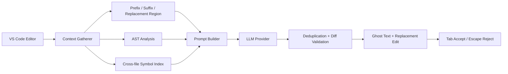
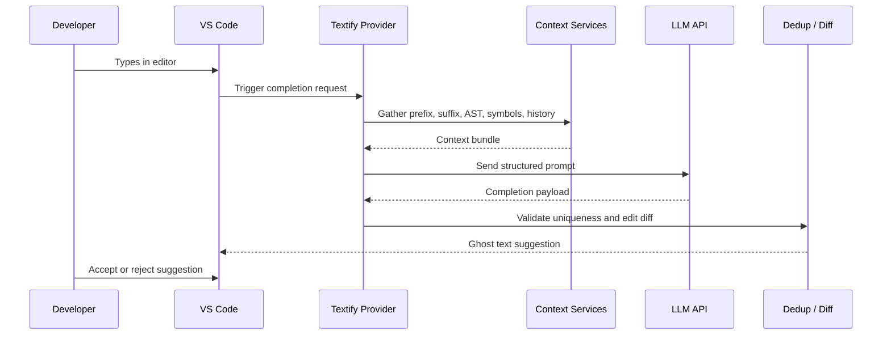

# Textify

<h1 align="center">
  <br>
  
</h1>

<p align="center">
  <a href="https://marketplace.visualstudio.com/items?itemName=BirabhadraSahoo.textify">
    
  </a>
  
  
  
</p>

<h4 align="center">AI-powered inline code completions for VS Code with context-aware, replacement-style editing.</h4>

<p align="center">
  <a href="https://marketplace.visualstudio.com/items?itemName=BirabhadraSahoo.textify"><b>📦 Install from the VS Code Marketplace</b></a>
</p>

<p align="center">
  <a href="#features">Features</a> •
  <a href="#getting-started">Getting Started</a> •
  <a href="#architecture">Architecture</a> •
  <a href="#tech-stack">Tech Stack</a> •
  <a href="#project-structure">Structure</a> •
  <a href="#settings">Settings</a> •
  <a href="#resources">Resources</a>
</p>

---

## Overview

Textify is a context-aware AI completion engine for VS Code. Instead of only inserting text at the cursor, it
understands the surrounding code, looks up nearby symbols and imports via the AST and the language server, and
proposes **replacement-style edits** — the model can rewrite the rest of the current statement, not just append
to it, and the diff is minimized before anything is shown to you.

Built for fast iteration in real-world coding sessions, it helps with:

- Typo correction
- Partial expression completion
- Statement rewrites with minimal diff noise
- Multi-file, cross-symbol context awareness
- Smarter accept/reject behavior in your normal editor flow

---

## Install

**From the Marketplace:** [BirabhadraSahoo.textify](https://marketplace.visualstudio.com/items?itemName=BirabhadraSahoo.textify)

**From the command line:**

```bash
code --install-extension BirabhadraSahoo.textify
```

**From the editor:** open the Extensions view (`Ctrl+Shift+X` / `Cmd+Shift+X`), search for **Textify**, and click Install.

After installing, add at least one AI provider API key — see [Configure credentials](#3-configure-credentials).

---

## Features

- AI-powered inline completions with multi-provider fallback (OpenRouter, Groq, Fireworks)
- Replacement-style edits that can overwrite the active region instead of only appending text
- Tree-sitter-based AST awareness for safer statement and scope boundaries
- Cross-file context gathering using workspace symbols and import analysis
- Completion caching to reduce repeated API load for similar contexts
- Deduplication and diff validation before displaying suggestions
- Deletion decorations for code that will be replaced by the generated edit
- Support for multiple languages including TypeScript, JavaScript, Python, Rust, Go, Java, C, and C++
- Token-aware prompt construction to stay inside model limits

---

## Getting Started

### Prerequisites

- [Visual Studio Code](https://code.visualstudio.com/) `^1.125.0`
- At least one AI provider API key: [OpenRouter](https://openrouter.ai/), [Groq](https://groq.com/), or [Fireworks](https://fireworks.ai/)

### 1. Install the extension

See [Install](#install) above.

### 2. Configure credentials

Open your VS Code `settings.json` (or the Settings UI, search "Textify") and add one provider key:

```json
{
  "textify.openrouterApiKey": "YOUR_OPENROUTER_KEY",
  "textify.model": "qwen/qwen3-32b",
  "textify.maxTokens": 500
}
```

Textify checks for a configured key in this priority order: OpenRouter → Groq → Fireworks.

### 3. Use it

- Open any supported source file and start typing.
- Suggestions appear as inline ghost text, with any replaced code shown struck through.
- Press `Tab` to accept, `Escape` to reject.

---

## Architecture

Textify collects editor context, assembles a structured prompt, and then validates the generated edit before
presenting it as inline ghost text.

<p align="center">
  
</p>

<details>
<summary><b>Inline Completion Provider — detailed flow</b></summary>
<p align="center">
  
</p>
</details>

<details>
<summary><b>Context Gatherer — detailed flow</b></summary>
<p align="center">
  
</p>
</details>

<details>
<summary>Mermaid source (renders on GitHub; view the images above if you're reading this on the Marketplace)</summary>





</details>

---

## Tech Stack

| Category | Technologies |
| --- | --- |
| Core | VS Code Extension API, TypeScript |
| AI Providers | OpenRouter, Groq, Fireworks |
| Parsing | Tree-sitter (`web-tree-sitter`) |
| Context | Workspace symbols, imports, AST analysis |
| Editor UX | Inline ghost text, replacement decoration |
| Build/Test | TypeScript, ESLint, VS Code test runner (`vscode-test`) |

---

## Project Structure

```text
textify/
├── src/
│   ├── extension.ts
│   ├── api/
│   │   └── apiClient.ts
│   ├── providers/
│   │   └── inlineCompletionProvider.ts
│   ├── services/
│   │   ├── astAnalysis.ts
│   │   ├── astService.ts
│   │   ├── configurationService.ts
│   │   ├── contextGatherer.ts
│   │   ├── deduplicationService.ts
│   │   ├── intentTracker.ts
│   │   ├── lspService.ts
│   │   ├── promptBuilder.ts
│   │   ├── contextStages/
│   │   │   ├── localDependencyResolver.ts
│   │   │   ├── prefixStage.ts
│   │   │   ├── replacementRegionStage.ts
│   │   │   └── suffixStage.ts
│   │   └── crossFile/
│   │       ├── crossFileService.ts
│   │       ├── referenceExtractor.ts
│   │       ├── signatureProvider.ts
│   │       └── symbolIndex.ts
│   ├── cache/
│   │   ├── boundedCache.ts
│   │   └── completionCache.ts
│   ├── ui/
│   │   └── deletionDecoration.ts
│   ├── utils/
│   │   ├── importAnalysis.ts
│   │   ├── languageUtils.ts
│   │   └── types.ts
│   └── test/
│       └── extension.test.ts
├── CHANGELOG.md
├── README.md
├── package.json
├── tsconfig.json
├── eslint.config.mjs
├── vsc-extension-quickstart.md
├── grammars/
├── scripts/
└── .vscode/
```

---

## Settings

All settings live under the `textify.*` namespace.

| Setting | Default | Description |
| --- | --- | --- |
| `textify.openrouterApiKey` | `""` | OpenRouter API key |
| `textify.groqApiKey` | `""` | Groq API key |
| `textify.fireworksApiKey` | `""` | Fireworks API key |
| `textify.model` | `"qwen/qwen3-32b"` | Active model for completions |
| `textify.maxTokens` | `500` | Maximum generated output tokens |
| `textify.CompletionCacheMaxEntries` | `100` | Max completion cache entries |
| `textify.completionCacheTtlMs` | `30000` | Completion cache expiry time in milliseconds |
| `textify.lspCacheMaxEntries` | `100` | Max LSP service cache entries |

---

## Keybindings

| Key | Action |
| --- | --- |
| `Tab` | Accept the active completion |
| `Escape` | Reject the active completion |

These bindings apply whenever an editor has focus; `Tab` falls back to VS Code's default `tab` command when
there is no pending Textify suggestion.

---

## Development

```bash
npm install              # install deps (also fetches tree-sitter grammar packages)
npm run compile          # tsc -p ./  (src/ -> out/)
npm run watch            # tsc -watch -p ./
npm run lint             # eslint src
npm run test             # compiles, lints, then runs vscode-test
```

Press `F5` in VS Code to launch an Extension Development Host and try changes locally.

---

## Resources

- [VS Code Marketplace listing](https://marketplace.visualstudio.com/items?itemName=BirabhadraSahoo.textify)
- [CHANGELOG.md](./CHANGELOG.md)
- [vsc-extension-quickstart.md](./vsc-extension-quickstart.md)
- [VS Code Extension API](https://code.visualstudio.com/api)

---

## Contributing

1. Create a feature branch.
2. Make your changes.
3. Run linting and tests (`npm run lint && npm run test`).
4. Open a pull request with clear notes and reproduction steps.

---

## License

MIT — see [package.json](./package.json) for details.
</content>
