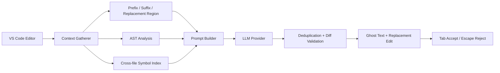
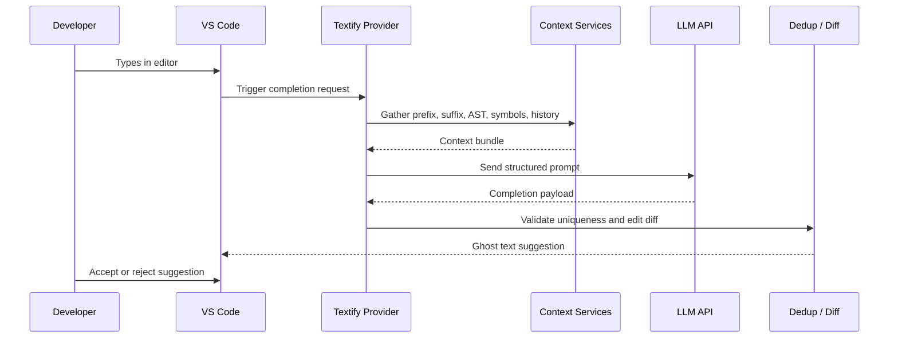

# Textify

<p align="center">
  
  
  
</p>

<h4 align="center">AI-powered inline code completions for VS Code with context-aware replacement editing.</h4>

<p align="center">
  <a href="#features">Features</a> •
  <a href="#architecture">Architecture</a> •
  <a href="#tech-stack">Tech Stack</a> •
  <a href="#project-structure">Structure</a> •
  <a href="#getting-started">Getting Started</a> •
  <a href="#settings">Settings</a>
</p>

---

## Overview

Textify is a context-aware AI completion engine built for VS Code. Instead of only inserting text at the cursor, it understands the surrounding code, looks up nearby symbols and imports, and can propose replacement-style edits that preserve developer intent.

This extension is designed for fast iteration in real-world coding sessions, helping with:

- typo correction
- partial expression completion
- statement rewrites with minimal diff noise
- multi-file context awareness
- smarter acceptance behavior in editor flows

---

## Features

- AI-powered inline completions with provider fallback support
- Replacement-style edits that can overwrite the active region instead of only appending text
- Tree-sitter-based AST awareness for safer statement and scope boundaries
- Cross-file context gathering using workspace symbols and import analysis
- Completion caching to reduce repeated API load for similar contexts
- Deduplication and diff validation before displaying suggestions
- Deletion decorations for code that will be replaced by the generated edit
- Support for multiple languages including TypeScript, JavaScript, Python, Rust, Go, Java, C, and C++
- Token-aware prompt construction to stay inside model limits

---

## Architecture

Textify collects editor context, assembles a structured prompt, and then validates the generated edit before presenting it as inline ghost text.

<div align="center">



</div>

### Completion pipeline

<div align="center">



</div>

---

## Tech Stack

| Category | Technologies |
| --- | --- |
| Core | VS Code Extension API, TypeScript |
| AI Providers | OpenRouter, Groq, Fireworks |
| Parsing | Tree-sitter |
| Context | Workspace symbols, imports, AST analysis |
| Editor UX | Inline ghost text, replacement decoration |
| Build/Test | TypeScript, ESLint, VS Code test runner |

---

## Project Structure

```text
textify/
├── src/
│   ├── extension.ts
│   ├── api/
│   │   └── apiClient.ts
│   ├── providers/
│   │   └── inlineCompletionProvider.ts
│   ├── services/
│   │   ├── astAnalysis.ts
│   │   ├── astService.ts
│   │   ├── configurationService.ts
│   │   ├── contextGatherer.ts
│   │   ├── deduplicationService.ts
│   │   ├── intentTracker.ts
│   │   ├── lspService.ts
│   │   ├── promptBuilder.ts
│   │   └── contextStages/
│   │       ├── localDependencyResolver.ts
│   │       ├── prefixStage.ts
│   │       ├── replacementRegionStage.ts
│   │       └── suffixStage.ts
│   ├── cache/
│   │   ├── boundedCache.ts
│   │   └── completionCache.ts
│   ├── crossFile/
│   │   ├── crossFileService.ts
│   │   ├── referenceExtractor.ts
│   │   ├── signatureProvider.ts
│   │   └── symbolIndex.ts
│   ├── ui/
│   │   └── deletionDecoration.ts
│   ├── utils/
│   │   ├── importAnalysis.ts
│   │   ├── languageUtils.ts
│   │   └── types.ts
│   └── test/
│       └── extension.test.ts
├── CHANGELOG.md
├── README.md
├── package.json
├── tsconfig.json
├── eslint.config.mjs
├── vsc-extension-quickstart.md
├── grammars/
├── scripts/
└── .vscode/
```

---

## Getting Started

### Prerequisites

- [Node.js](https://nodejs.org/) 18+
- [Visual Studio Code](https://code.visualstudio.com/)
- At least one AI provider API key: OpenRouter, Groq, or Fireworks

### 1. Install dependencies

```bash
npm install
```

### 2. Launch the extension in development mode

1. Open the project in VS Code.
2. Press `F5` to run the extension in a new Extension Development Host window.
3. Open any supported source file.
4. Start typing to trigger inline completions.

### 3. Configure credentials

Add your API key in VS Code settings, for example:

```json
{
  "textify.openrouterApiKey": "YOUR_OPENROUTER_KEY",
  "textify.model": "qwen/qwen3-32b",
  "textify.maxTokens": 500
}
```

### 4. Use the extension

- Type in a supported language file.
- Watch inline suggestions appear as ghost text.
- Press `Tab` to accept or `Escape` to reject.

---

## Settings

### Core settings

| Setting | Default | Description |
| --- | --- | --- |
| `textify.openrouterApiKey` | `""` | OpenRouter API key |
| `textify.groqApiKey` | `""` | Groq API key |
| `textify.fireworksApiKey` | `""` | Fireworks API key |
| `textify.model` | `"qwen/qwen3-32b"` | Active model for completions |
| `textify.maxTokens` | `500` | Maximum generated output tokens |

### Planned settings

| Setting | Default | Description |
| --- | --- | --- |
| `textify.CompletionCacheMaxEntries` | `100` | Max completion cache entries |
| `textify.completionCacheTtlMs` | `30000` | Cache expiry time in milliseconds |
| `textify.lspCacheMaxEntries` | `100` | Max LSP service cache entries |

---

## Keybindings

| Key | Action |
| --- | --- |
| `Tab` | Accept the active completion |
| `Escape` | Reject the active completion |

---

## Development

```bash
npm run compile
npm run watch
npm run lint
npm run test
```

---

## Known Issues

- The `textify.helloWorld` command is present in the extension manifest but is not yet a key runtime feature.
- Intent tracking exists in the codebase but is not yet fully integrated into all completion prompts.
- Several advanced architecture components are planned and are being incrementally added.

---

## Resources

- [CHANGELOG.md](./CHANGELOG.md)
- [vsc-extension-quickstart.md](./vsc-extension-quickstart.md)
- [VS Code Extension API](https://code.visualstudio.com/api)

---

## Contributing

1. Create a feature branch.
2. Make your changes.
3. Run linting and tests.
4. Open a pull request with clear notes and reproduction steps.

