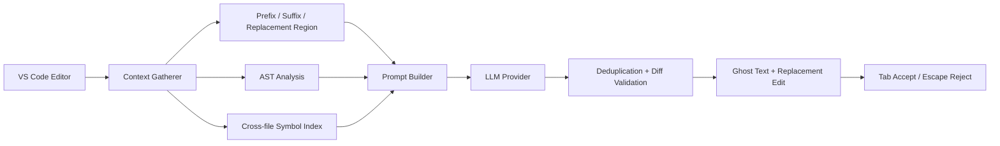
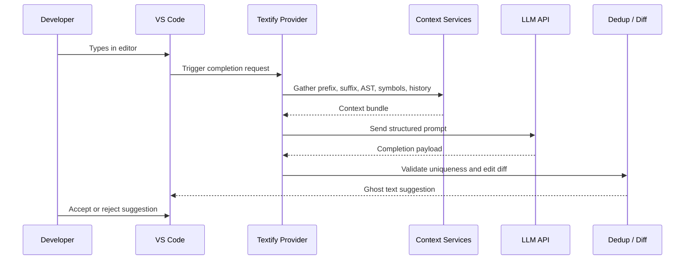

# Textify

<h1 align="center">
  <br>
  
</h1>

<p align="center">
  <a href="https://marketplace.visualstudio.com/items?itemName=BirabhadraSahoo.textify">
    
  </a>
  
  
  
</p>

<h4 align="center">AI-powered inline code completions for VS Code with context-aware, replacement-style editing.</h4>

<p align="center">
  <a href="https://marketplace.visualstudio.com/items?itemName=BirabhadraSahoo.textify"><b>📦 Install from the VS Code Marketplace</b></a>
</p>

<p align="center">
  <a href="#features">Features</a> •
  <a href="#getting-started">Getting Started</a> •
  <a href="#architecture">Architecture</a> •
  <a href="#tech-stack">Tech Stack</a> •
  <a href="#project-structure">Structure</a> •
  <a href="#settings">Settings</a> •
  <a href="#resources">Resources</a>
</p>

---

## Overview

Textify is a context-aware AI completion engine for VS Code. Instead of only inserting text at the cursor, it
understands the surrounding code, looks up nearby symbols and imports via the AST and the language server, and
proposes **replacement-style edits** — the model can rewrite the rest of the current statement, not just append
to it, and the diff is minimized before anything is shown to you.

Built for fast iteration in real-world coding sessions, it helps with:

- Typo correction
- Partial expression completion
- Statement rewrites with minimal diff noise
- Multi-file, cross-symbol context awareness
- Smarter accept/reject behavior in your normal editor flow

---

## Install

**From the Marketplace:** [BirabhadraSahoo.textify](https://marketplace.visualstudio.com/items?itemName=BirabhadraSahoo.textify)

**From the command line:**

```bash
code --install-extension BirabhadraSahoo.textify
```

**From the editor:** open the Extensions view (`Ctrl+Shift+X` / `Cmd+Shift+X`), search for **Textify**, and click Install.

After installing, add at least one AI provider API key — see [Configure credentials](#3-configure-credentials).

---

## Features

- AI-powered inline completions with multi-provider fallback (OpenRouter, Groq, Fireworks, Gemini, Claude)
- Custom providers: any OpenAI-compatible or Anthropic-compatible endpoint (Together, DeepSeek, Ollama, LM Studio, proxies)
- Custom instructions: global, per-language, and per-workspace (`.textify/instructions.md`) guidance for how completions are written
- Latency tooling: per-stage timings, connection pre-warming, typing debounce, and a built-in benchmark
- Local model servers (Ollama, LM Studio, llama.cpp, vLLM) with automatic model detection
- Usage metrics like Claude Code's `/cost`: tokens (input / output / cache read / cache write), cost, API time, acceptance rate, and lines changed — per session and all time
- Replacement-style edits that can overwrite the active region instead of only appending text
- Tree-sitter-based AST awareness for safer statement and scope boundaries
- Cross-file context gathering using workspace symbols and import analysis
- Completion caching to reduce repeated API load for similar contexts
- Deduplication and diff validation before displaying suggestions
- Deletion decorations for code that will be replaced by the generated edit
- Support for multiple languages including TypeScript, JavaScript, Python, Rust, Go, Java, C, and C++
- Token-aware prompt construction to stay inside model limits

---

## Getting Started

### Prerequisites

- [Visual Studio Code](https://code.visualstudio.com/) `^1.125.0`
- At least one AI provider API key: [OpenRouter](https://openrouter.ai/), [Groq](https://groq.com/), [Fireworks](https://fireworks.ai/), [Gemini](https://ai.google.dev/), or [Claude](https://platform.claude.com/) — or a custom/local endpoint

### 1. Install the extension

See [Install](#install) above.

### 2. Configure credentials

Open your VS Code `settings.json` (or the Settings UI, search "Textify") and add one provider key:

```json
{
  "textify.openrouterApiKey": "YOUR_OPENROUTER_KEY",
  "textify.model": "qwen/qwen3-32b",
  "textify.maxTokens": 500
}
```

The easiest way is the **Textify** panel in the activity bar: pick a provider in the **API Keys** dropdown,
paste the key, and click **Test connection**.

With `textify.provider` set to `auto`, Textify uses the first configured key in this order:
OpenRouter → Groq → Fireworks → Gemini → Claude → custom providers.

### 3. Use it

- Open any supported source file and start typing.
- Suggestions appear as inline ghost text, with any replaced code shown struck through.
- Press `Tab` to accept, `Escape` to reject.

### 4. Tell the model how to write completions (optional)

Instructions are added to the system prompt, from lowest to highest precedence:

1. `textify.customInstructions` — global (the **Instructions** box in the Textify panel)
   — or click **Upload file…** to load a `.md` / `.txt` file into it (append or replace)
2. `textify.languageInstructions` — per language id, e.g. `{ "python": "Use type hints." }`
3. `.textify/instructions.md` in the workspace — commit it to share conventions with your team
   (run **Textify: Edit Workspace Instructions**; HTML comments in the file are ignored)

`textify.systemPromptMode` is `append` (default: add to the built-in guidance) or `replace` (use only your
instructions). In both modes the output-format rules are kept, because the extension diffs the raw model
output against your code.

### 5. Add a custom provider (optional)

In the Textify panel choose **+ Add custom provider**, then enter a name, API format (OpenAI-compatible or
Anthropic Messages), base URL, optional key, and model names. URLs are normalized — `https://host/v1` becomes
`…/v1/chat/completions` for OpenAI format, and `…/v1/messages` is handled by the SDK for Anthropic format.
Keys are optional so local servers like `http://localhost:11434/v1` (Ollama) work.

For a model running on your machine, click **+ Add local server**: it fills in the Ollama URL and detects the
installed models (via `/v1/models`, falling back to Ollama's `/api/tags`). LM Studio (`:1234/v1`), llama.cpp
(`:8080/v1`) and vLLM work the same way — change the URL and click **Detect models**.

### Usage metrics

The status bar shows this session's tokens and cost; hover for a breakdown, click for the full report
(**Textify: Show Usage**), which follows Claude Code's `/cost` layout:

```text
Total cost:            $0.0171
Total duration (API):  3.5s
Total duration (wall): 1m 30.0s
Total code changes:    14 lines added, 3 lines removed
Requests:              12 (10 completed, 2 cancelled, 0 failed)
Suggestions:           8 shown (2 from cache), 6 accepted, 1 rejected · 75% acceptance
Usage by model:
    claude-haiku-4-5:  12k input, 900 output, 4k cache read, 1k cache write ($0.0171)
```

Token counts are the ones each provider reports in its stream. Cost works for every provider; for each
provider + model, the first available source wins:

1. **Reported by the provider** on the response (OpenRouter)
2. **Your price** — set it in the panel's **Model prices** list (stored in `textify.modelPricing`, per provider or per model)
3. **List price** — Claude models
4. **Local** — local model servers are $0
5. **≈ Catalog** — OpenRouter's public price list, matched by model name (handles Groq's `-versatile`/`-instant`
   and Fireworks' `v3p3` spellings). Refreshed daily; turn off with `textify.fetchPricingCatalog`.

Anything still unknown is shown as *unpriced*, never as free. Costs are computed when displayed, so setting a
price later also prices earlier usage. Usage is tracked per provider, so the same model on two providers can have
different prices. The **Usage** section of the panel shows the same data for this session or all time, and
**Textify: Reset Usage Metrics** clears it. Cancelled requests are counted, but providers don't report tokens
for them.

### Measuring latency

- Every completion logs `debounce / context / prompt / ttft / request / total` timings to the **Textify** output channel,
  and the panel's **Latency** section shows rolling p50/p90.
- **Textify: Measure Completion Latency** (or **Run latency benchmark** in the panel) sends 5 small requests and reports
  cold vs. warm time-to-first-token.
- From a terminal: `npm run compile && node scripts/benchmark-latency.js --provider anthropic --model claude-haiku-4-5`
  (key from `ANTHROPIC_API_KEY`, `GROQ_API_KEY`, …), or `--mock` for a local run without a key.

Model choice dominates latency: small models (e.g. `claude-haiku-4-5`, `llama-3.1-8b-instant`) respond fastest.

---

## Architecture

Textify collects editor context, assembles a structured prompt, and then validates the generated edit before
presenting it as inline ghost text.

<p align="center">
  
</p>

<details>
<summary><b>Inline Completion Provider — detailed flow</b></summary>
<p align="center">
  
</p>
</details>

<details>
<summary><b>Context Gatherer — detailed flow</b></summary>
<p align="center">
  
</p>
</details>

<details>
<summary>Mermaid source (renders on GitHub; view the images above if you're reading this on the Marketplace)</summary>


```mermaid
flowchart LR
    A[VS Code Editor] --> B[Context Gatherer]
    B --> C[Prefix / Suffix / Replacement Region]
    B --> D[AST Analysis]
    B --> E[Cross-file Symbol Index]
    C --> F[Prompt Builder]
    D --> F
    E --> F
    F --> G[LLM Provider]
    G --> H[Deduplication + Diff Validation]
    H --> I[Ghost Text + Replacement Edit]
    I --> J[Tab Accept / Escape Reject]
```


```mermaid
sequenceDiagram
    participant User as Developer
    participant VS as VS Code
    participant T as Textify Provider
    participant C as Context Services
    participant L as LLM API
    participant D as Dedup / Diff

    User->>VS: Types in editor
    VS->>T: Trigger completion request
    T->>C: Gather prefix, suffix, AST, symbols, history
    C-->>T: Context bundle
    T->>L: Send structured prompt
    L-->>T: Completion payload
    T->>D: Validate uniqueness and edit diff
    D-->>VS: Ghost text suggestion
    User->>VS: Accept or reject suggestion
```

</details>

---

## Tech Stack

| Category | Technologies |
| --- | --- |
| Core | VS Code Extension API, TypeScript |
| AI Providers | OpenRouter, Groq, Fireworks, Gemini |
| Parsing | Tree-sitter (`web-tree-sitter`) |
| Context | Workspace symbols, imports, AST analysis |
| Editor UX | Inline ghost text, replacement decoration |
| Build/Test | TypeScript, ESLint, VS Code test runner (`vscode-test`) |

---

## Project Structure

```text
textify/
├── src/
│   ├── extension.ts
│   ├── api/
│   │   ├── apiClient.ts
│   │   ├── providers.ts
│   │   └── transports.ts
│   ├── providers/
│   │   └── inlineCompletionProvider.ts
│   ├── services/
│   │   ├── astAnalysis.ts
│   │   ├── astService.ts
│   │   ├── configurationService.ts
│   │   ├── contextGatherer.ts
│   │   ├── deduplicationService.ts
│   │   ├── intentTracker.ts
│   │   ├── lspService.ts
│   │   ├── promptBuilder.ts
│   │   ├── instructionsService.ts
│   │   ├── latencyBenchmark.ts
│   │   ├── usageTracker.ts
│   │   ├── pricingCatalog.ts
│   │   ├── contextStages/
│   │   │   ├── localDependencyResolver.ts
│   │   │   ├── prefixStage.ts
│   │   │   ├── replacementRegionStage.ts
│   │   │   └── suffixStage.ts
│   │   └── crossFile/
│   │       ├── crossFileService.ts
│   │       ├── referenceExtractor.ts
│   │       ├── signatureProvider.ts
│   │       └── symbolIndex.ts
│   ├── cache/
│   │   ├── boundedCache.ts
│   │   └── completionCache.ts
│   ├── ui/
│   │   └── deletionDecoration.ts
│   ├── utils/
│   │   ├── importAnalysis.ts
│   │   ├── languageUtils.ts
│   │   ├── latencyTracker.ts
│   │   ├── pricing.ts
│   │   └── types.ts
│   └── test/
│       └── extension.test.ts
├── CHANGELOG.md
├── README.md
├── package.json
├── tsconfig.json
├── eslint.config.mjs
├── vsc-extension-quickstart.md
├── grammars/
├── scripts/
└── .vscode/
```

---

## Settings

All settings live under the `textify.*` namespace.

| Setting | Default | Description |
| --- | --- | --- |
| `textify.openrouterApiKey` | `""` | OpenRouter API key |
| `textify.groqApiKey` | `""` | Groq API key |
| `textify.fireworksApiKey` | `""` | Fireworks API key |
| `textify.geminiApiKey` | `""` | Gemini API key |
| `textify.anthropicApiKey` | `""` | Anthropic (Claude) API key |
| `textify.customProviders` | `[]` | Custom OpenAI-/Anthropic-compatible providers (managed from the panel) |
| `textify.provider` | `"auto"` | `auto`, a builtin id, or `custom:<id>` |
| `textify.model` | `"qwen/qwen3-32b"` | Active model for completions (falls back to the provider's default if incompatible) |
| `textify.maxTokens` | `500` | Maximum generated output tokens |
| `textify.temperature` | `0.1` | Sampling temperature (ignored by Claude models that reject sampling params) |
| `textify.customInstructions` | `""` | Instructions added to the system prompt |
| `textify.languageInstructions` | `{}` | Per-language instructions keyed by language id |
| `textify.systemPromptMode` | `"append"` | `append` to or `replace` the built-in guidance |
| `textify.debounceMs` | `50` | Wait after the last keystroke before requesting (0 disables) |
| `textify.debugLogging` | `false` | Log full prompts to the output channel |
| `textify.showUsageInStatusBar` | `true` | Show session tokens and cost in the status bar |
| `textify.modelPricing` | `{}` | Your prices (USD per 1M tokens), keyed `"<provider>:<model>"` or `"<model>"`, e.g. `{ "groq:llama-3.3-70b-versatile": { "input": 0.59, "output": 0.79 } }` |
| `textify.fetchPricingCatalog` | `true` | Download OpenRouter's public price list (no key or code sent) to estimate cost for any provider |
| `textify.completionCacheMaxEntries` | `100` | Max completion cache entries |
| `textify.completionCacheTtlMs` | `30000` | Completion cache expiry time in milliseconds |
| `textify.lspCacheMaxEntries` | `100` | Max LSP service cache entries |

---

## Keybindings

| Key | Action |
| --- | --- |
| `Tab` | Accept the active completion |
| `Escape` | Reject the active completion |

These bindings apply whenever an editor has focus; `Tab` falls back to VS Code's default `tab` command when
there is no pending Textify suggestion.

---

## Development

```bash
npm install              # install deps (also fetches tree-sitter grammar packages)
npm run compile          # tsc -p ./  (src/ -> out/)
npm run watch            # tsc -watch -p ./
npm run lint             # eslint src
npm run test             # compiles, lints, then runs vscode-test
```

Press `F5` in VS Code to launch an Extension Development Host and try changes locally.

---

## Resources

- [VS Code Marketplace listing](https://marketplace.visualstudio.com/items?itemName=BirabhadraSahoo.textify)
- [CHANGELOG.md](./CHANGELOG.md)
- [vsc-extension-quickstart.md](./vsc-extension-quickstart.md)
- [VS Code Extension API](https://code.visualstudio.com/api)

---

## Contributing

1. Create a feature branch.
2. Make your changes.
3. Run linting and tests (`npm run lint && npm run test`).
4. Open a pull request with clear notes and reproduction steps.

---

## License

MIT — see [package.json](./package.json) for details.
</content>
